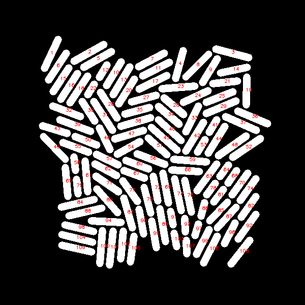
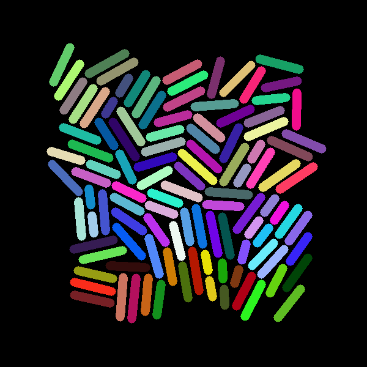
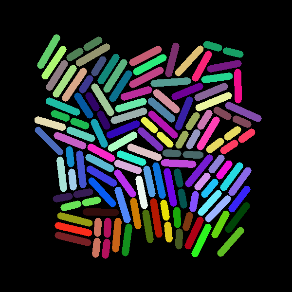

# BacTrak
To find the registration of the cell between two frames. First, load the binary image. We have two binary images 'J.png' and the successor 'J_plus.png' in folder 'Sample'.
You can run the code, when you start to run the code it will save two images in the folder 'Sample', which display assigned label of the cells. Like:

 
 
 
 
 When the process finished you will see something like this:
 
Linking mother and children started

 11%|█         | 551/5000 [00:26<03:35, 20.64it/s]
 
No split registration started

 20%|█▉        | 394/2000 [27:41<1:52:53,  4.22s/it]
 
At the end the code will return a python dictionary which is the result of the registration of cells. It will save the dictionary in 'Registration.npy' file in the folder 'Sample'.
The keys of the dictionary is the label of cell in 'J' and the values of the dictionary are the labels of cells in 'J_plus'. If a cell split we have a tuple for the value.
Besides that, the code save the colored registration of the cells in the Saple folder. Each color in 'J' represent a cell. Each color in 'J_plus' represent the registration of the cell with the same color from 'J'. Like:

  
 
 
 
