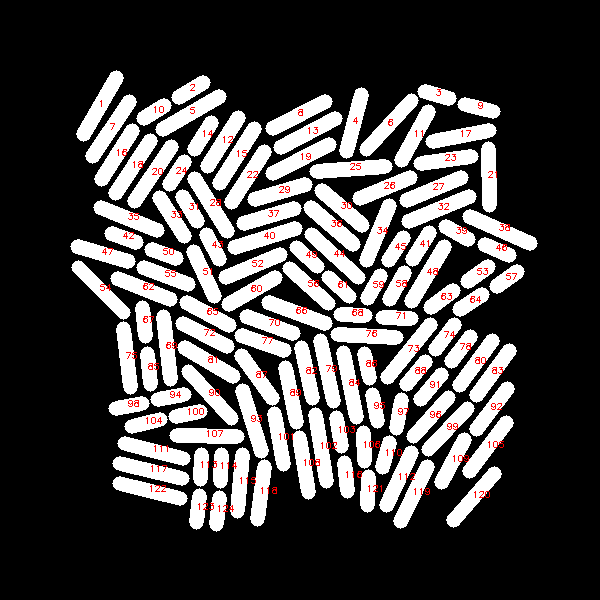

# BacTrak

BacTrak is a Python implementation of the tracking algorithm described in the following manuscript:

S. Saramadi et al. *Stochastic Neural Networks for Automatic Cell Tracking in Microscopy Image Sequences of Bacterial Colonies*. arXiv preprint, arXiv:2104.13482, 2022 [[arxiv](https://arxiv.org/abs/2104.13482).
 

## Examples and Benchmarks

We have included some benchmark files into this repository: Two binary images named 'J.png' (first frame) and 'J_plus.png' (second frame) in the 'Sample' subfolder. These images are shown below. The software used to generate these synthetic images can be found in the following repository: https://github.com/jwinkle/eQ. Our code can be executed using these two test images.

 
 
 
 

After executing the code the following information will be displayed in your command window: 
``` 
Linking mother and children started

 11%|█         | 551/5000 [00:26<03:35, 20.64it/s]
 
No split registration started

 20%|█▉        | 394/2000 [27:41<1:52:53,  4.22s/it]
``` 


At the end the code will return a python dictionary which is the result of the registration of cells. The dictionary will be saved as 'Registration.npy' in the folder 'Sample'.

The keys of the dictionary are the labels of the cells in 'J' and the values of the dictionary are the labels of the associated cells in 'J_plus'. If a cell devides we have a tuple for the value in the dictionary.

Besides that, we also store pictures to illustrate the registration results inside the 'Sample' folder. The colors of the cells designate the identified mapping. The colors establish a cell-to-cell correspondence between the cells in the image 'J' and the image 'J_plus'. We include an illustration below. 


<p align="center">


</p>
 
 


## Citation

A BibTeX entry for LaTeX users are
```TeX
@article{Saramadi:2022a,
author = "S. Sarmadi and J. J. Winkle and R. N. Alnahhas and M. R. Bennett and K. Josic and A. Mang and R. Azencott"
title = "Stochastic Neural Networks for Automatic Cell Tracking in Microscopy Image Sequences of Bacterial Colonies",
journal = "arXiv",
volume = "arXiv:2104.13482",
year = "2022"}
```
